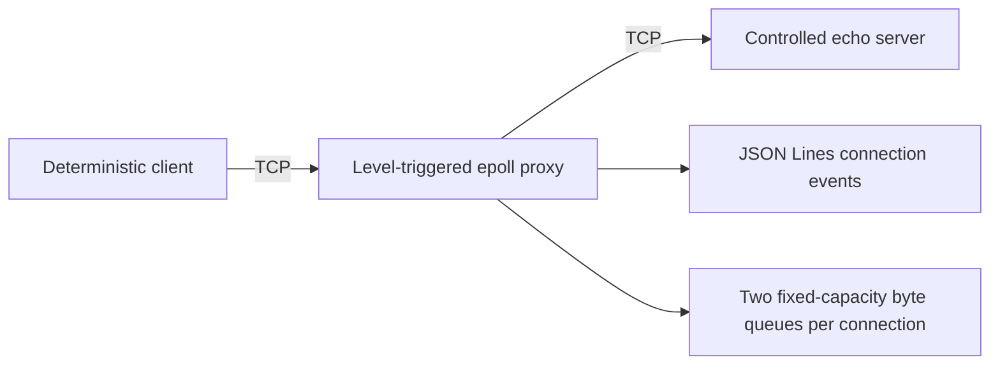

# NetFault Lab

NetFault Lab is a Linux/C++20 workbench for reproducing and explaining TCP failure behavior in isolated, authorized test environments.

> **Milestone 1 status:** the repository currently implements loopback-safe, nonblocking, bidirectional TCP forwarding with Linux `epoll`, fixed-capacity per-direction buffers, orderly half-close propagation, structured connection logs, a controlled echo server, a deterministic binary client, unit tests, and a Linux container test. Fault injection, configuration files, benchmark claims, and the dashboard are not implemented yet.

## Safety first

- The proxy, test server, and client use `127.0.0.1` by default.
- Non-loopback proxy listening and upstream access require separate explicit unsafe flags and emit warnings.
- The controlled server and client remain loopback-only in Milestone 1.
- No payload content is logged.
- Normal operation does not require root, firewall changes, packet interception, or `tc`.
- Use only systems and destinations you own or are explicitly authorized to test.

See [SECURITY.md](SECURITY.md) for the full boundary.

## Architecture



Each connection owns both sockets and both directional queues. Socket readiness is represented by opaque epoll tokens so stale events cannot access a removed connection. Reads and writes continue until `EAGAIN`, but level-triggered notification was selected for the first milestone because it is easier to audit. `EPOLLIN` is removed when the corresponding destination queue is full; `EPOLLOUT` is requested only while queued bytes remain.

The full design, state model, assumptions, risk register, and milestone plan are in [docs/milestone-0-design.md](docs/milestone-0-design.md). Actual Milestone 1 commands, results, failures, and remaining gaps are recorded in [docs/milestone-1-report.md](docs/milestone-1-report.md).

## Build and test

The authoritative target is Linux. On macOS or Windows, use the container.

```bash
docker build -f containers/Dockerfile -t netfault-lab:m1 .
docker run --rm netfault-lab:m1
```

On a Linux host with CMake, Ninja, Catch2 3, a C++20 compiler, and Python 3:

```bash
cmake --preset asan-ubsan
cmake --build --preset asan-ubsan --parallel
ctest --preset asan-ubsan
```

## Manual Milestone 1 demo

Run these in three Linux terminals after a debug/release build:

```bash
build/debug/netfault-server --listen 127.0.0.1:9000 --mode echo
```

```bash
build/debug/netfault-proxy \
  --listen 127.0.0.1:8080 \
  --upstream 127.0.0.1:9000
```

```bash
build/debug/netfault-client \
  --connect 127.0.0.1:8080 \
  --connections 8 \
  --payload-bytes 1048576 \
  --seed 12345
```

The client prints a machine-readable summary. The proxy prints JSON Lines lifecycle events and byte/high-water totals, never payload content. Proxy logging is nonblocking: a stalled output consumer can cause bounded event loss, reported by `dropped_log_events`, but cannot stall network forwarding.

## Current behavior

- Numeric IPv4 endpoints only; DNS and IPv6 are intentionally deferred.
- 256 active connections by default.
- 65,536 bytes per direction per connection by default.
- Buffer size is validated between 1 KiB and 16 MiB.
- Upstream connect uses nonblocking `connect()` and `SO_ERROR` completion.
- Client and upstream EOF are distinct; buffered bytes drain before `shutdown(SHUT_WR)` propagates the half-close.
- `signalfd` handles `SIGINT`/`SIGTERM` in the event loop for clean proxy shutdown.

## Known limitations

- No configurable faults, timers, YAML parser, metrics endpoint, latency percentiles, benchmark runner, or dashboard yet.
- Connection logs are structured but the metrics model is still per-connection and internal.
- The controlled server supports only echo mode.
- The client measures total connection transfer duration, not request/response latency distributions.
- The proxy uses IPv4 and level-triggered `epoll` only.
- Milestone 2 must harden buffer-saturation observability, high/low watermarks, timeout policy, and stress coverage before this is presented as a backpressure workbench.

## Roadmap

1. Basic TCP forwarding — current milestone.
2. Bounded-buffer/backpressure metrics and saturation tests.
3. Nonblocking latency/jitter, token-bucket bandwidth, stalls, half-close/reset fault policies, and deterministic configuration.
4. Metrics export and reproducible benchmark harness.
5. Sanitizer/stress CI, containers, packet-capture comparison, and professional documentation.
6. Optional dashboard and thread-per-connection comparison.

No performance numbers will be published until the benchmark methodology is implemented and run.
