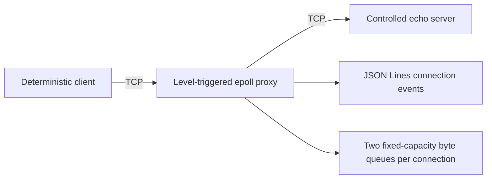

# NetFault Lab

NetFault Lab is a Linux/C++20 workbench for reproducing and explaining TCP failure behavior in isolated, authorized test environments.

> **Milestone 5 status:** the core workbench is complete — loopback-safe, nonblocking, bidirectional TCP forwarding with Linux `epoll`, bounded buffers with configurable watermarks, orderly half-close propagation, deterministic seeded fault injection (latency/jitter, token-bucket rate limits, reset and half-close injection), timerfd-driven connect/idle timeouts, structured connection logs, an atomically written JSON metrics export, a request-response benchmark client with reproducible pooled latency percentiles, boundary payload sweeps, an aborting soak with FD/RSS plateau evidence, a packet-capture comparison reconciling the wire against the event log, and GitHub Actions CI under Release, ASan/UBSan, and TSan. YAML configuration, absolute performance claims, and the optional dashboard are not implemented.

**See it work in five minutes: [docs/demo.md](docs/demo.md)** — the benchmark client measures the proxy's own fault injection, and the logged delay budget reconciles against the measured distribution.

## Safety first

- The proxy, test server, and client use `127.0.0.1` by default.
- Non-loopback proxy listening and upstream access require separate explicit unsafe flags and emit warnings.
- The controlled server and client remain loopback-only.
- No payload content is logged.
- Normal operation does not require root, firewall changes, packet interception, or `tc`.
- Use only systems and destinations you own or are explicitly authorized to test.

See [SECURITY.md](SECURITY.md) for the full boundary.

## Architecture



Each connection pairs its two sockets with a `Relay`: the forwarding engine that owns both directional queues, backpressure watermarks, half-close flags, and byte accounting. The relay reaches sockets only through a `SocketIo` interface, so unit tests substitute a scripted fake that deterministically forces partial writes, `EAGAIN`, EOF, and resets. Socket readiness is represented by opaque epoll tokens so stale events cannot access a removed connection. Reads pause at the high-water mark and resume at the low-water mark; `EPOLLOUT` is requested only while queued bytes remain. Level-triggered notification was selected because it is easier to audit.

Fault injection composes over this engine rather than branching inside socket code: each direction may carry a delay line (latency/jitter segments over the same bounded queue, so delay creates no hidden storage) and a token bucket, while lifecycle faults (reset, injected half-close) trigger on forwarded-byte budgets. A destination blocked purely on time suppresses `EPOLLOUT` and reports its earliest useful wake time; one `CLOCK_MONOTONIC` timerfd, armed from a min-heap of `(deadline, sequence)` entries, drives those wakes plus connect/idle timeouts. All fault randomness derives from one master seed through documented SplitMix64 mixing, so runs are reproducible.

The full design, state model, assumptions, risk register, and milestone plan are in [docs/milestone-0-design.md](docs/milestone-0-design.md). Milestone execution evidence is recorded in [docs/milestone-1-report.md](docs/milestone-1-report.md), [docs/milestone-2-report.md](docs/milestone-2-report.md), [docs/milestone-3-report.md](docs/milestone-3-report.md), [docs/milestone-4-report.md](docs/milestone-4-report.md), and [docs/milestone-5-report.md](docs/milestone-5-report.md).

## Build and test

The authoritative target is Linux. On macOS or Windows, use the container.

```bash
docker build -f containers/Dockerfile -t netfault-lab .
docker run --rm netfault-lab
```

On a Linux host with CMake, Ninja, Catch2 3, a C++20 compiler, and Python 3:

```bash
cmake --preset asan-ubsan
cmake --build --preset asan-ubsan --parallel
ctest --preset asan-ubsan
```

## Manual demo

Run these in three Linux terminals after a debug/release build:

```bash
build/debug/netfault-server --listen 127.0.0.1:9000 --mode echo
```

```bash
build/debug/netfault-proxy \
  --listen 127.0.0.1:8080 \
  --upstream 127.0.0.1:9000
```

```bash
build/debug/netfault-client \
  --connect 127.0.0.1:8080 \
  --connections 8 \
  --payload-bytes 1048576 \
  --seed 12345
```

The client prints a machine-readable summary. The proxy prints JSON Lines lifecycle events and byte/high-water totals, never payload content. Proxy logging is nonblocking: a stalled output consumer can cause bounded event loss, reported by `dropped_log_events`, but cannot stall network forwarding.

To observe backpressure, run the server with `--mode slow-reader --delay-ms 2 --chunk-bytes 4096` and the proxy with small watermarks (`--buffer-bytes 8192 --low-water-bytes 2048 --high-water-bytes 8192`); the proxy logs `read_paused`/`read_resumed` transitions. Send `SIGUSR1` to the proxy (`kill -USR1 <pid>`) for a live metrics snapshot of every connection.

To observe fault injection, add for example `--fault-latency-ms 200 --fault-jitter-ms 50 --fault-seed 42`: the client's transfer time jumps by the round-trip delay, and the close event records the delayed segment count and delay budget. `--fault-rate-bytes-per-sec` throttles a direction, `--fault-reset-after-bytes` and `--fault-half-close-after-bytes` inject lifecycle failures, and `--fault-probability 0.5` applies the plan to a reproducible seed-derived subset of connections (each decision is logged as `fault_config`). `--connect-timeout-ms` and `--idle-timeout-ms` close hung or quiet connections in a distinct `timed_out` state.

To measure instead of stream, run the client in benchmark mode against the proxy:

```bash
build/debug/netfault-client --connect 127.0.0.1:8080 \
  --mode request-response --connections 2 --requests 100 --request-bytes 1024
```

The summary reports pooled nearest-rank latency percentiles plus the full configuration, seed, and environment (methodology in the [Milestone 4 report](docs/milestone-4-report.md)). Add `--metrics-file /path/metrics.json` to the proxy to export an atomically written JSON metrics document on `SIGUSR1` and at shutdown.

## Current behavior

- Numeric IPv4 endpoints only; DNS and IPv6 are intentionally deferred.
- 256 active connections by default.
- 65,536 bytes per direction per connection by default; buffer size is validated between 1 KiB and 16 MiB.
- Reads pause at `--high-water-bytes` occupancy and resume at `--low-water-bytes`; pause/resume/saturation counts and paused duration are reported per direction.
- `--socket-buffer-bytes` constrains the upstream socket's kernel buffers for saturation and partial-write testing.
- Upstream connect uses nonblocking `connect()` and `SO_ERROR` completion.
- Client and upstream EOF are distinct; buffered bytes drain before `shutdown(SHUT_WR)` propagates the half-close.
- `signalfd` handles `SIGINT`/`SIGTERM` for clean shutdown and `SIGUSR1` for metrics snapshots in the event loop.
- The controlled server supports `echo`, `slow-reader`, `slow-writer`, `read-until-eof`, and `send-then-half-close` modes.
- Deterministic faults: `--fault-latency-ms`/`--fault-jitter-ms` (uniform, clamped non-negative, never reorders bytes), `--fault-rate-bytes-per-sec`/`--fault-burst-bytes` (integer-exact token bucket), `--fault-reset-after-bytes`, `--fault-half-close-after-bytes`, gated per connection by `--fault-probability` and reproducible from `--fault-seed`.
- Connect and idle timeouts (`--connect-timeout-ms`, `--idle-timeout-ms`) close connections as `timed_out` via a timerfd; the event loop never sleeps.

## Known limitations

- No YAML parser, stall faults, metrics endpoint (the export is an on-demand file), or dashboard.
- Faults are proxy-global: every fault-applied connection receives the same plan.
- The benchmark measures sequential request/response only; no pipelining or open-loop load, and no absolute performance numbers are published.
- The soak's CI duration is 45 seconds; longer soaks are manual via `NETFAULT_SOAK_SECONDS`.
- The proxy uses IPv4 and level-triggered `epoll` only.

## Roadmap

1. Basic TCP forwarding — complete ([report](docs/milestone-1-report.md)).
2. Bounded-buffer/backpressure metrics and saturation tests — complete ([report](docs/milestone-2-report.md)).
3. Nonblocking latency/jitter, token-bucket bandwidth, half-close/reset fault policies, timeouts, and deterministic seeding — complete ([report](docs/milestone-3-report.md)).
4. Metrics export and reproducible benchmark harness — complete ([report](docs/milestone-4-report.md)).
5. Stress/soak evidence, payload sweeps, packet-capture comparison, Release CI lane, and demo documentation — complete ([report](docs/milestone-5-report.md)).
6. Optional: dashboard and thread-per-connection comparison — not planned unless needed.

No performance numbers will be published until the benchmark methodology is implemented and run.
