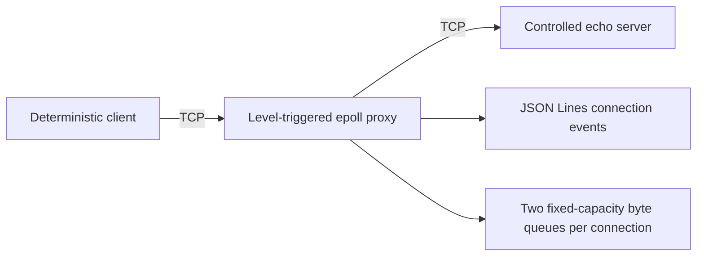

# NetFault Lab

NetFault Lab is a Linux/C++20 workbench for reproducing and explaining TCP failure behavior in isolated, authorized test environments.

> **Milestone 2 status:** the repository implements loopback-safe, nonblocking, bidirectional TCP forwarding with Linux `epoll`, fixed-capacity per-direction buffers with configurable high/low watermarks, orderly half-close propagation, structured connection logs, a `SIGUSR1` metrics snapshot, a controlled server with echo/slow/half-close modes, a deterministic binary client, unit and fault-scenario integration tests, and a Linux container test. Fault injection, configuration files, benchmark claims, and the dashboard are not implemented yet.

## Safety first

- The proxy, test server, and client use `127.0.0.1` by default.
- Non-loopback proxy listening and upstream access require separate explicit unsafe flags and emit warnings.
- The controlled server and client remain loopback-only.
- No payload content is logged.
- Normal operation does not require root, firewall changes, packet interception, or `tc`.
- Use only systems and destinations you own or are explicitly authorized to test.

See [SECURITY.md](SECURITY.md) for the full boundary.

## Architecture



Each connection pairs its two sockets with a `Relay`: the forwarding engine that owns both directional queues, backpressure watermarks, half-close flags, and byte accounting. The relay reaches sockets only through a `SocketIo` interface, so unit tests substitute a scripted fake that deterministically forces partial writes, `EAGAIN`, EOF, and resets. Socket readiness is represented by opaque epoll tokens so stale events cannot access a removed connection. Reads pause at the high-water mark and resume at the low-water mark; `EPOLLOUT` is requested only while queued bytes remain. Level-triggered notification was selected because it is easier to audit.

The full design, state model, assumptions, risk register, and milestone plan are in [docs/milestone-0-design.md](docs/milestone-0-design.md). Milestone execution evidence is recorded in [docs/milestone-1-report.md](docs/milestone-1-report.md) and [docs/milestone-2-report.md](docs/milestone-2-report.md).

## Build and test

The authoritative target is Linux. On macOS or Windows, use the container.

```bash
docker build -f containers/Dockerfile -t netfault-lab .
docker run --rm netfault-lab
```

On a Linux host with CMake, Ninja, Catch2 3, a C++20 compiler, and Python 3:

```bash
cmake --preset asan-ubsan
cmake --build --preset asan-ubsan --parallel
ctest --preset asan-ubsan
```

## Manual demo

Run these in three Linux terminals after a debug/release build:

```bash
build/debug/netfault-server --listen 127.0.0.1:9000 --mode echo
```

```bash
build/debug/netfault-proxy \
  --listen 127.0.0.1:8080 \
  --upstream 127.0.0.1:9000
```

```bash
build/debug/netfault-client \
  --connect 127.0.0.1:8080 \
  --connections 8 \
  --payload-bytes 1048576 \
  --seed 12345
```

The client prints a machine-readable summary. The proxy prints JSON Lines lifecycle events and byte/high-water totals, never payload content. Proxy logging is nonblocking: a stalled output consumer can cause bounded event loss, reported by `dropped_log_events`, but cannot stall network forwarding.

To observe backpressure, run the server with `--mode slow-reader --delay-ms 2 --chunk-bytes 4096` and the proxy with small watermarks (`--buffer-bytes 8192 --low-water-bytes 2048 --high-water-bytes 8192`); the proxy logs `read_paused`/`read_resumed` transitions. Send `SIGUSR1` to the proxy (`kill -USR1 <pid>`) for a live metrics snapshot of every connection.

## Current behavior

- Numeric IPv4 endpoints only; DNS and IPv6 are intentionally deferred.
- 256 active connections by default.
- 65,536 bytes per direction per connection by default; buffer size is validated between 1 KiB and 16 MiB.
- Reads pause at `--high-water-bytes` occupancy and resume at `--low-water-bytes`; pause/resume/saturation counts and paused duration are reported per direction.
- `--socket-buffer-bytes` constrains the upstream socket's kernel buffers for saturation and partial-write testing.
- Upstream connect uses nonblocking `connect()` and `SO_ERROR` completion.
- Client and upstream EOF are distinct; buffered bytes drain before `shutdown(SHUT_WR)` propagates the half-close.
- `signalfd` handles `SIGINT`/`SIGTERM` for clean shutdown and `SIGUSR1` for metrics snapshots in the event loop.
- The controlled server supports `echo`, `slow-reader`, `slow-writer`, `read-until-eof`, and `send-then-half-close` modes.

## Known limitations

- No configurable faults, timers, YAML parser, latency percentiles, benchmark runner, or dashboard yet.
- Metrics snapshots are delivered as log events; there is no queryable endpoint.
- No connect, idle, drain, or workload timeouts exist inside the proxy.
- The client measures total connection transfer duration, not request/response latency distributions.
- The proxy uses IPv4 and level-triggered `epoll` only.

## Roadmap

1. Basic TCP forwarding — complete ([report](docs/milestone-1-report.md)).
2. Bounded-buffer/backpressure metrics and saturation tests — complete ([report](docs/milestone-2-report.md)).
3. Nonblocking latency/jitter, token-bucket bandwidth, stalls, half-close/reset fault policies, and deterministic configuration — next milestone.
4. Metrics export and reproducible benchmark harness.
5. Sanitizer/stress CI, containers, packet-capture comparison, and professional documentation.
6. Optional dashboard and thread-per-connection comparison.

No performance numbers will be published until the benchmark methodology is implemented and run.
