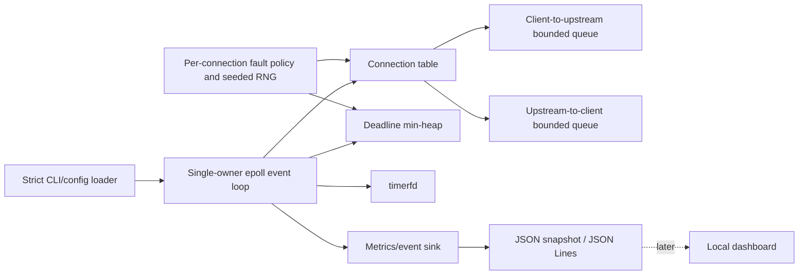
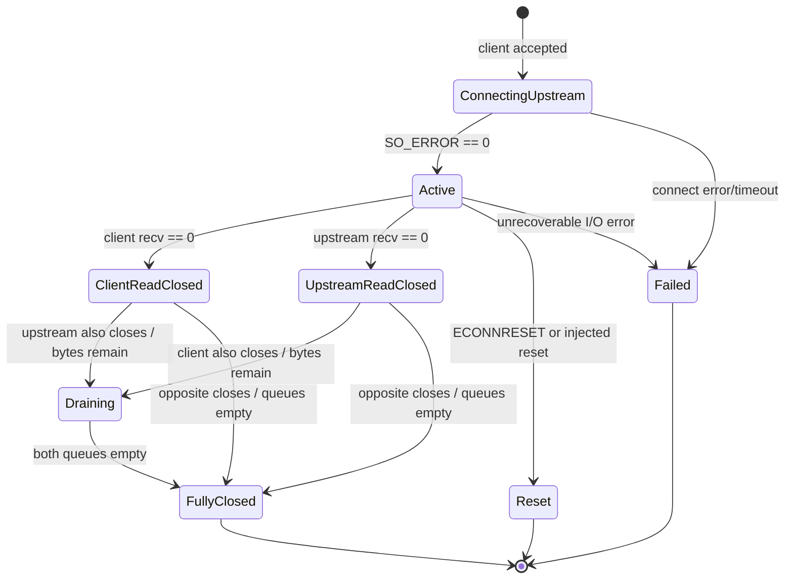

# Milestone 0 — Repository Audit and Design

## 1. Repository and environment assessment

No pre-existing NetFault Lab directory, repository, source file, test, or configuration was found under the authorized workspace. This is therefore a new implementation rather than a rewrite.

The development host is Apple Silicon macOS 26.6 with Apple Clang 21 and CMake 4.3.2. Since `epoll`, `signalfd`, and Linux TCP behavior are project requirements, host-native compilation is deliberately rejected. Docker Desktop 29.4.3 provides the authoritative `aarch64` Linux environment. No container image was present before this project was created.

Tools observed on the host include Git, Docker CLI, and `tcpdump`. Linux `tc netem`, Linux `perf`, GCC/Clang sanitizers, and packet captures must be run inside a Linux environment or later controlled container with the required capabilities. Normal proxy tests require no privilege.

## 2. Assumptions to confirm later

1. Linux is the only supported runtime for the MVP; portability to BSD `kqueue`, Windows IOCP, or macOS is out of scope.
2. Numeric IPv4 endpoints are sufficient through Milestone 3. DNS and IPv6 are later work.
3. Initial experiments use a local echo-style request pattern and arbitrary binary payloads. The proxy remains protocol-agnostic at the byte-stream layer; “protocol-aware” initially means it reports correct TCP lifecycle/fault semantics rather than parsing application payloads.
4. YAML is the intended human configuration format, but the parser is deferred until fault policy exists. CLI-only Milestone 1 prevents a configuration schema from hardening prematurely.
5. One event-loop thread owns every proxy connection in the MVP. Concurrency comes from many sockets, not shared connection state. A later metrics/dashboard consumer must not mutate the event loop’s objects.
6. Reasonable defaults are 256 active connections and 64 KiB per direction per connection, making the configured payload capacity approximately 32 MiB plus object/kernel overhead at the default connection limit.
7. Dropping application bytes on queue saturation is not acceptable for ordinary forwarding. Reading pauses instead. Explicit destructive fault policies may later drop/reset, but must report the action.

## 3. Clarified MVP scope

The complete MVP ends at Milestone 5 and includes:

- A single-threaded nonblocking `epoll` proxy.
- Controlled local server behaviors and deterministic client/load generation.
- Fixed latency, reproducible jitter, per-direction token buckets, stalls, slow-reader/writer behavior, injected half-closes/resets, and connection timeouts.
- Fixed-capacity queues with read pausing, explicit saturation policy, high-water metrics, and correct half-close drain.
- Strict human-readable fault configuration with resource limits and deterministic seed.
- Structured events, JSON metrics snapshots, reproducible benchmark artifacts, sanitizers, integration/stress tests, and a local container demonstration.

Explicit non-goals are QUIC, eBPF, deep-packet inspection, transparent interception, public proxy service, automatic firewall/qdisc changes, Kubernetes, and a dashboard before the backend is reliable.

Milestone 1 implements only correct forwarding and the minimum safety/observability needed to validate it.

## 4. Proposed architecture



The event-loop thread is the sole owner and mutator of connection state. Each connection owns two `UniqueFd` sockets, two fixed-capacity queues, two endpoint states, a fault-policy instance, timing data, and counters. `epoll_event.data.u64` contains an opaque monotonically assigned token. A separate token map resolves the connection and side; removing a connection erases both tokens, so another event already returned by `epoll_wait` becomes a harmless stale lookup.

Level-triggered `epoll` is selected initially. Both level- and edge-triggered modes require correct loops through `read`/`write` until `EAGAIN`; level-triggering provides a recovery notification if an early implementation mistake leaves work pending. Edge triggering may reduce event churn, but it should be introduced only after a measured comparison and invariants/tests prove that every readiness edge is fully drained.

Resource ownership:

- `ProxyRuntime` owns the listener, signal descriptor, epoll descriptor, connection table, token table, and logger.
- Each `Connection` uniquely owns its client/upstream descriptors and queues.
- No raw pointer owns a resource. Connections are `unique_ptr` values only to keep references stable inside an event dispatch.
- Connection removal first unregisters descriptors, then erases tokens, logs final metrics, and finally destroys the connection/descriptors.
- The proxy has no detached threads. `signalfd` delivers shutdown in the same event loop.

## 5. Connection-state model

One large enum cannot accurately encode both sockets’ independent read/write lifecycles without a state explosion. The model therefore has a **coarse connection lifecycle** plus **orthogonal endpoint-direction states**.



Each endpoint separately tracks `read_open`, `write_open`, and (upstream only) `connecting`. Each direction has a queue and later a scheduling/throttle state. This makes “client can no longer send, but can still receive the server response” representable without ambiguous Boolean flags.

## 6. Data flow

1. Listener readiness accepts every available client until `EAGAIN` and enforces `max_connections`.
2. A nonblocking upstream socket is created. `connect()` either succeeds or returns `EINPROGRESS`; completion is verified with `getsockopt(SO_ERROR)` on `EPOLLOUT`.
3. Client bytes enter only the client-to-upstream queue; upstream bytes enter only the upstream-to-client queue. Payloads are never interpreted or logged.
4. Destination writes consume queued spans. Partial writes consume only the returned count. `EAGAIN` preserves the remaining bytes and enables `EPOLLOUT`.
5. Source reads pause by removing `EPOLLIN` when the corresponding destination queue is full. When writes free capacity, `EPOLLIN` is restored.
6. EOF closes only that endpoint’s read direction. After its outbound queue drains, the proxy calls `shutdown(opposite, SHUT_WR)` exactly once and keeps the reverse direction alive.
7. Both read sides closed plus both queues empty produces orderly final cleanup. Reset/fatal error produces immediate cleanup and a distinct final state.

## 7. Buffer and backpressure strategy

Each connection uses two fixed-capacity circular byte queues allocated once at acceptance. There is no unbounded per-connection payload container.

- Destination returns `EAGAIN`: retain data, request destination `EPOLLOUT`, and stop reading if the queue becomes full.
- Queue reaches capacity: remove source `EPOLLIN`. Do not drop bytes and do not close during ordinary forwarding.
- Destination drains below capacity: restore source `EPOLLIN`. Milestone 2 will add explicit configurable high/low watermarks to avoid interest thrashing; Milestone 1 resumes on any available space.
- Reader stops consuming: kernel send buffers eventually fill, then the user-space directional queue fills, then upstream/source reading pauses. Total user-space memory remains bounded.
- One source half-closes: its buffered direction drains, then `shutdown(destination, SHUT_WR)` propagates EOF. Reverse traffic continues.
- Timeout with queued data: future policy must report queued byte count and whether it resets or orderly-closes. No silent drop.
- Saturation metrics: current size and lifetime high-water mark per direction. Milestone 1 logs final high-water values; Milestone 2 adds snapshots/events.

## 8. Fault-policy design

Fault injection will be a per-connection composition of small policies, not conditionals scattered through socket code.

Proposed interface concepts:

- `FaultContext`: connection ID, direction, monotonic time, queue sizes, byte count, lifecycle event.
- `FaultDecision`: pass now, schedule at deadline, throttle until deadline, stall, half-close, reset, or reject.
- `FaultPolicy`: immutable validated parameters plus connection-local deterministic RNG/state.
- `FaultEvent`: wall/monotonic timestamp, connection ID, fault type, direction, parameters, trigger, result.

The configured master seed derives a stable per-connection/per-direction seed using a documented mixing function. Results must not depend on unordered-map iteration order. Probabilities are sampled only at specified semantic trigger points, such as connection accepted, Nth transfer chunk, or scheduled interval—not every event-loop wakeup.

Faults are classified as:

- **Delay/scheduling:** latency, jitter, slow writer, stall.
- **Admission/read pacing:** slow reader and buffer pressure.
- **Rate:** token bucket per connection and direction.
- **Lifecycle/destructive:** local half-close, reset, connect/idle timeout.

## 9. Timer strategy

Milestone 3 will use one nonblocking `timerfd` registered with `epoll` plus a min-heap of deadlines keyed by `(deadline, sequence)`.

- Delayed bytes remain in bounded queue segments with an `eligible_at` time; latency never sleeps or blocks the event loop.
- The earliest heap deadline arms `timerfd` in absolute monotonic time. Reading the timer descriptor clears readiness, then all due operations are processed before rearming.
- A stable sequence number breaks equal-deadline ties, keeping seeded experiments reproducible.
- Jitter is sampled from a documented bounded distribution. A proposed v1 distribution is uniform `[-jitter,+jitter]`, clamped so total delay never becomes negative.
- Cancelling/closing a connection invalidates its scheduled records by connection generation/token; stale heap entries are discarded lazily and cannot access freed memory.
- Scheduled bytes count against the same per-direction capacity. Delay cannot create unbounded hidden storage.
- Shutdown stops accepting clients, records/cancels future fault actions, and applies a documented drain deadline before forced cleanup.

A controllable `Clock` abstraction will let token-bucket/deadline unit tests advance time without sleeping.

## 10. Metrics design

Counters are updated only by the event-loop owner in the MVP, avoiding atomics on the hot path. Snapshot export later copies a value-type aggregate.

Planned metric groups:

- **Lifecycle:** accepted, active, connected upstream, failed upstream, orderly close, reset, timeout, duration.
- **Bytes/operations:** received and forwarded each direction, rejected/dropped, read/write calls, partial writes, `EAGAIN`.
- **Queues:** current and high-water bytes per direction, read-pause count/time, throttle wait.
- **Faults:** count by type/direction/result and timestamped event stream.
- **Latency/throughput:** client-measured transfer/request distributions using a bounded histogram or recorded samples in benchmark mode; proxy process rate snapshots.
- **Process:** CPU time from `clock_gettime`/`getrusage`, RSS from `/proc/self/status` or `statm`, open FD count in diagnostics.

JSON snapshots are the first export. Prometheus text and the dashboard consume a documented DTO/API later and never reach into connection objects. Payloads, remote content, and secrets are excluded.

## 11. Testing strategy

### Unit

- Circular queue wrap, capacity, accounting, and high-water behavior.
- Numeric endpoint parsing and loopback detection.
- Next: state-transition table, connection IDs, config limits, deterministic RNG, min-heap ordering, token bucket with fake clock, metric aggregation.

### Integration

- Current Milestone 1: controlled echo server, proxy, and 8 deterministic concurrent clients each forwarding 1 MiB, followed by orderly process shutdown.
- Next: payload sizes around socket/queue boundaries, upstream refusal, one-sided half-close, forced partial writes, saturation, process signals, and hundreds of connection cycles.

### Stress/reliability

- ASan+UBSan authoritative debug run; TSan separately because it cannot be combined reliably with ASan.
- Repeated create/destroy, random deterministic payload sizes, abrupt endpoints, long-duration soak, `/proc/<pid>/fd` baseline, RSS plateau.
- Every test and subprocess has a timeout. Failed random seeds are printed and retained.

## 12. Security and safety controls

- Listener defaults to `127.0.0.1`; non-loopback requires a named unsafe flag and warning.
- Upstream defaults to and is restricted to loopback unless a separate unsafe flag is supplied. Numeric addresses avoid DNS rebinding in the early implementation.
- Test server and client are strictly loopback-only in Milestone 1.
- Maximum connections and queue capacity are validated before listening. Client workload also has explicit bounds.
- Structured logs contain lifecycle/aggregate byte information only, never payload data. The event-loop logger uses nonblocking writes; a stalled sink increments a dropped-event counter instead of blocking forwarding.
- Malformed/unknown CLI options fail closed with a nonzero status. Future configuration will have a strict schema, unknown-key rejection, range checks, and a size limit.
- Proxy uses no root privileges, firewall changes, transparent mode, raw sockets, packet interception, or automatic `tc` commands.
- Privileged `tc netem` comparison will be an opt-in documented experiment against fixed local containers, not application behavior.
- `signalfd` integrates `SIGINT`/`SIGTERM` cleanly. `MSG_NOSIGNAL` prevents unexpected process termination on a closed peer.
- Non-loopback destination allowlists, log rotation/volume limits, idle/connect/drain timeouts, and privilege dropping remain mandatory before broader binding is considered mature.

## 13. Proposed repository structure

```text
netfault-lab/
├── CMakeLists.txt
├── CMakePresets.json
├── README.md
├── LICENSE
├── SECURITY.md
├── CONTRIBUTING.md
├── configs/                 # added with the fault schema
├── docs/
│   ├── milestone-0-design.md
│   ├── architecture.md      # split from design as implementation grows
│   ├── fault-model.md
│   ├── tcp-half-close.md
│   └── benchmarking.md
├── include/netfault/
├── src/{common,proxy,server,client,faults,metrics}/
├── tests/{unit,integration,stress}/
├── benchmarks/{manifests,raw,plots}/
├── scripts/
├── containers/
├── dashboard/               # intentionally absent until Milestone 6
└── .github/workflows/       # added after local sanitizer tests stabilize
```

Empty directories are not created merely to match a diagram.

## 14. Milestone plan

| Milestone | Deliverable | Exit evidence |
|---|---|---|
| 0 | Audit/design/safety/state model | This document reviewed; assumptions recorded |
| 1 | Correct forwarding | Unit + concurrent binary integration tests under ASan/UBSan; clean signal shutdown |
| 2 | Backpressure hardening | Saturation/slow-reader tests; queue snapshots; bounded RSS/FD evidence |
| 3 | Fault policies and timerfd | Every fault isolated and reproducible; event loop never sleeps; fake-clock unit tests |
| 4 | Metrics/benchmark client | Machine-readable runs with environment/config/seed; no unsupported claims |
| 5 | Reliability/docs/CI/demo | Sanitizers, stress/soak, container demo, packet comparison, GitHub Actions |
| 6 | Optional experiments/UI | Dashboard/API, reference thread model, flamegraphs only after prior exits pass |

## 15. Risks and mitigation

| Risk | Mitigation |
|---|---|
| Half-close state explosion | Coarse lifecycle plus independent endpoint read/write state; table-driven tests |
| Stale epoll events after deletion | Opaque token map erased before connection destruction |
| Unbounded delayed/throttled data | One fixed-capacity queue budget includes scheduled bytes |
| Event-loop stall | No sleep/blocking calls; timerfd and nonblocking descriptors only |
| Nondeterministic faults | Stable derived seeds, explicit sampling points, monotonic clock, event sequence IDs |
| Benchmark self-deception | Direct/no-fault baselines, environment manifest, warmup/repetitions, correctness oracle, raw data |
| Open-proxy misuse | Loopback defaults, separate unsafe flags, numeric allowlist, prominent warnings, no transparent mode |
| Dashboard distracts from systems work | It is gated on Milestone 5 acceptance |
| Toolchain differs on macOS | Linux-only CMake guard and pinned Ubuntu container |
| Test hangs | CTest and subprocess deadlines; eventual per-connection timeouts |

## 16. First files created or modified

The first reviewable change set creates:

- Build: `CMakeLists.txt`, `CMakePresets.json`, `containers/Dockerfile`.
- Public interfaces: `unique_fd.hpp`, `byte_queue.hpp`, `endpoint.hpp`, `logger.hpp`, `proxy.hpp`.
- Milestone 1 implementation: common endpoint/logging, proxy, echo server, deterministic client.
- Verification: queue/endpoint unit tests and one concurrent binary integration test.
- Project boundary: `README.md`, this design, `SECURITY.md`, `.gitignore`, `.dockerignore`, license/contribution notes.

The next change set should not add fault injection. It should first add targeted half-close, refused-upstream, queue saturation, and file-descriptor cleanup tests around this implementation.

## 17. Milestone 1 acceptance criteria

- Builds as C++20 on Linux with the strict warning set and no suppressed warnings.
- Unit tests pass under ASan+UBSan.
- Eight simultaneous connections each round-trip a deterministic 1 MiB arbitrary binary payload through the proxy with exact equality.
- Nonblocking upstream connection and partial I/O loops are exercised by payloads much larger than the 64 KiB user-space queue.
- Both directions propagate orderly EOF only after buffered data drains.
- Default listener/upstream are loopback; non-loopback proxy values fail without explicit flags.
- No payload appears in logs; final events include byte counts, duration, and directional queue high-water marks.
- `SIGTERM` stops proxy/server within the integration timeout without forced kill.
- ASan reports no memory leak/error and UBSan reports no undefined behavior in the executed tests.
- Known gaps are documented; passing Milestone 1 does not imply fault injection or benchmark readiness.
